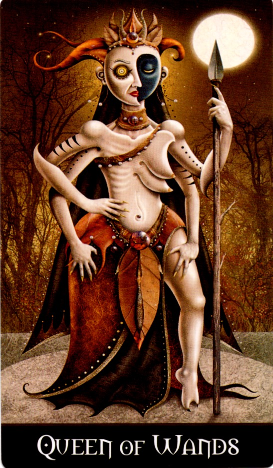

# 🔥 Invocation: The Power of One

**A personal inner work from _Your Unseen Power_ by Dolores Ashcroft-Nowicki.**

---

## 🌕 概要
このワークは、ドロレス・アッシュクロフト＝ノーウィッキーによる『Your Unseen Power』に収録された「Power of One」の宣言をもとにした内的ワークです。

視覚的な補助として、Deviant Moon Tarot の "Queen of Wands" のカードを用いることもできます。これは任意ですが、自身の力とつながる象徴的なゲートとして効果的です。

---

## 🖼️ カードの観想（Optional）
このワークをより深めたい方は、**Deviant Moon Tarot** の「Queen of Wands」を使用し、以下の手順で視覚化してみてください：

1. 儀式の前にカードをよく観察する（特に背景・手の動き・表情）
2. カードを閉じて、目を閉じてその姿を再現できるまで繰り返す
3. カードの中に「自分の意識」が入っていくイメージをもつ
4. 十の力の宣言を始める

このカードは、**意志・創造・カリスマ・霊的自信**の象徴であり、「Power of One」のワークと非常に親和性があります。

---

## 🔮 英語部分（Invocation）
**Invocation: The Power of One**  
*From _Your Unseen Power_ by Dolores Ashcroft-Nowicki*

> I am the Power of One, I know myself to be Divine.  
> I am the Power of Two, I have internal Polarity and Balance.  
> I am the Power of Three, I am able to Learn and to Teach.  
> I am the Power of Four, I am aligned with the Four Elements.  
> I am the Power of Five, I have contact with the Powers of the Spirit.  
> I am the Power of Six, I can create or destroy.  
> I am the Power of Seven, I have attunement to the Higher Powers.  
> I am the Power of Eight, I have the ability to change and to control change.  
> I am the Power of Nine, I can manipulate Time and Space.  
> I will be the Power of Ten at the completion of my Journey.

---

## 🇯🇵 日本語訳

> 私は「一の力」。自らが神聖なる存在であることを知る。  
> 私は「二の力」。内なる極性とバランスを備えている。  
> 私は「三の力」。学び、教えることができる。  
> 私は「四の力」。四大元素と調和している。  
> 私は「五の力」。霊的な存在とつながっている。  
> 私は「六の力」。創造し、破壊することができる。  
> 私は「七の力」。高次の力に波長を合わせることができる。  
> 私は「八の力」。変化し、変化を制御する力を持っている。  
> 私は「九の力」。時と空間を操作することができる。  
> 私は「十の力」となる——私の旅が完了するときに。

---

## 📋 License
This work is part of the Open Source Witchcraft project.  
Distributed under Creative Commons BY-SA 4.0 License.

GitHub: https://github.com/ravensgate-tux
